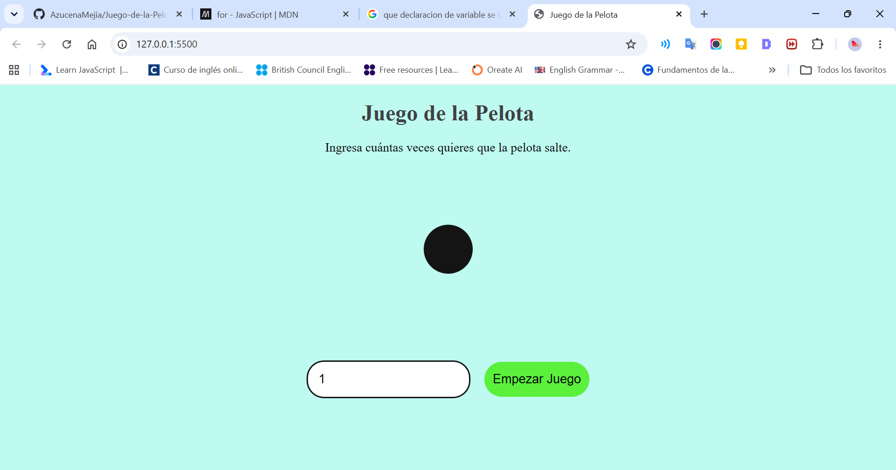

# Juego de la Pelota 🏀

### Descripción
El programa pide al usuario que ingrese un número de saltos mediante un campo de entrada. Al presionar el botón "Empezar Juego", la pelota saltará dinámicamente la cantidad de veces indicada en pantalla, mostrando un contador en tiempo real.

### Características Clave
* **Validación de entrada:** Evita errores si el usuario ingresa texto o números negativos.
* **Animaciones fluidas:** Uso de eventos de JavaScript (`animationend`) para reiniciar las animaciones de CSS de forma limpia.
* **Diseño responsivo y limpio:** Interfaz amigable con colores pasteles y botones estilizados.

### Diseño del Proyecto

---

### Tecnologías Utilizadas
* **HTML5:** Estructura semántica del juego.
* **CSS3:** Estilos visuales, diseño con Flexbox y animaciones con `@keyframes`.
* **JavaScript (ES6):** Lógica del contador, manejo de bucles con retraso (`setTimeout`) y manipulación del DOM.

### Cómo Ejecutar el Proyecto
1. Clona este repositorio o descarga los archivos en tu computadora.
2. Abre el archivo `index.html` en cualquier navegador web (puedes usar la extensión *Live Server* en Visual Studio Code).
3. ¡Ingresa el número de saltos y mira la pelota saltar!

---
Desarrollado con ❤️ por Azucena Mejía.
